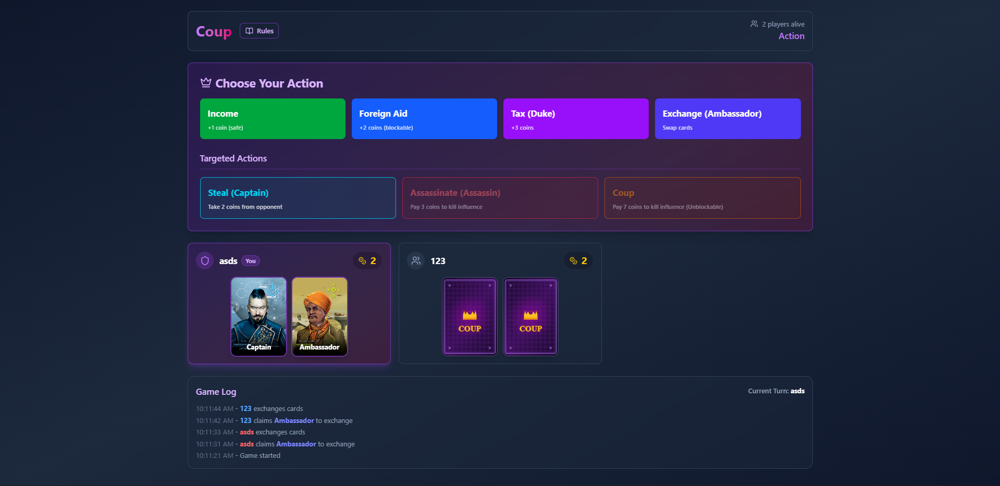
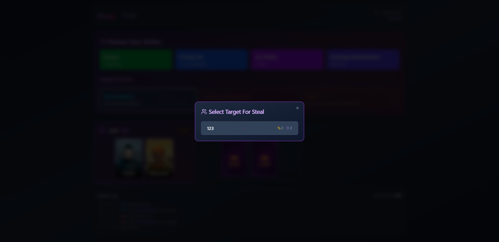

# Coup Game

A multiplayer Coup card game built with Next.js, featuring 3D rendered cards and real-time gameplay using PartyKit.

## Gameplay Preview





## Getting Started

First, install dependencies:

```bash
npm install
```

Create a `.env.local` file in the root directory:

```bash
cp .env.local.example .env.local
```

Then, run both the PartyKit server and Next.js development server:

```bash
# Terminal 1: Start PartyKit server
npx partykit dev

# Terminal 2: Start Next.js
npm run dev
```

Open [http://localhost:3000](http://localhost:3000) with your browser to see the result.

The PartyKit server will run on `localhost:1999` and handle all real-time multiplayer synchronization.

## Game Rules

See [Rules.md](./Rules.md) for the complete game rules.

## Technologies Used

- **Next.js** - Frontend framework with App Router
- **PartyKit** - Real-time multiplayer synchronization and game state management
- **React Three Fiber** - 3D card rendering
- **Tailwind CSS** - Styling
- **shadcn/ui** - UI components

## Architecture

The game uses a client-side architecture with PartyKit handling real-time synchronization:
- All game logic runs on the client (`lib/game-logic.ts`)
- PartyKit manages multiplayer state synchronization
- Players join games using unique 6-character codes
- Game state is shared between all players in real-time

## Learn More

- [Next.js Documentation](https://nextjs.org/docs)
- [PartyKit Documentation](https://docs.partykit.io/)
- [React Three Fiber Documentation](https://docs.pmnd.rs/react-three-fiber)

## Deploy

Deploy on Vercel with PartyKit integration:
1. Deploy the Next.js frontend on [Vercel](https://vercel.com)
2. Deploy the PartyKit server following [PartyKit deployment guide](https://docs.partykit.io/guides/deploying-your-partykit-server/)
